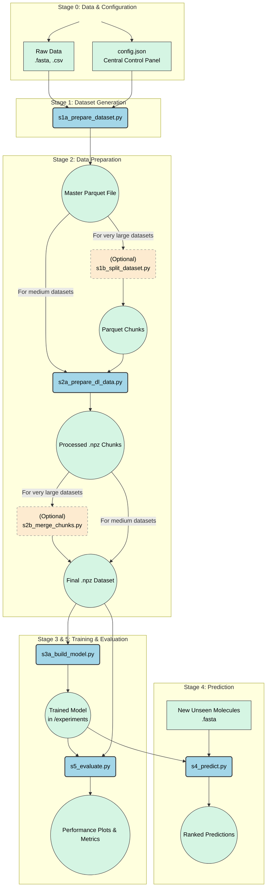

<div align="center">

# BioSeq-AffinityPredict: A Hybrid Deep Learning Framework for Predicting Molecular Affinity

</div>

<p align="center">
  <a href="https://opensource.org/licenses/MIT"></a>
  <a href="https://www.python.org/downloads/"></a>
  <a href="https://www.tensorflow.org/"></a>
  <a href="https://github.com/psf/black"></a>
</p>

A research-grade, hybrid deep learning framework for predicting the binding affinity between molecules (e.g., miRNA-RNA), explicitly modeling the competitive effects of other molecules in the system. This framework features a universal feature engineering pipeline that processes RNA, protein, and 3D structural data, making it a powerful and adaptable tool for discovering novel therapeutic candidates.

---
### Table of Contents
* [Guiding Principles](#guiding-principles)
* [Abstract](#abstract)
* [Project Workflow](#project-workflow)
* [Key Features](#key-features)
* [Project Structure](#project-structure)
* [Installation](#installation)
* [End-to-End Workflow](#end-to-end-workflow)
* [Model Limitations & Future Work](#model-limitations--future-work)
* [Online Prediction Tool](#online-prediction-tool)
* [Citing this Work](#citing-this-work)

---

## Guiding Principles

This project is built on three core principles:

* **🔬 Biological Realism:** Moving beyond simple predictions to model the complex, competitive nature of the cellular environment.
* **⚙️ Scalability:** Engineering a memory-safe, chunk-based pipeline capable of processing massive, terabyte-scale biological datasets.
* **🕹️ Reproducibility:** Ensuring that any experiment can be precisely reproduced through a single, centralized configuration file.

---

## Abstract

The regulation of gene expression by microRNAs (miRNAs) is a fundamental biological process implicated in numerous diseases. Computational prediction of miRNA-target affinity is critical for identifying therapeutic candidates, yet models often oversimplify the complex cellular environment. This project, **BioSeq-AffinityPredict**, introduces a state-of-the-art hybrid **CNN-LSTM-Attention-GNN** architecture to perform a regression task, predicting a continuous binding affinity score. Critically, our framework features a universal molecule processor that automatically handles RNA and protein sequences, performs reverse translation, and integrates 3D structural data (PDB/mmCIF) to generate graph-based features. This allows for a more nuanced, biologically relevant, and accurate prediction of molecular interactions.


-----

## Project Workflow

This diagram illustrates the complete, end-to-end data processing and modeling pipeline.



-----

## Key Features

<div align="justify">
 
  - **🧠 Hybrid Deep Learning Architecture:** Goes beyond simple CNNs to a "Supreme" model fusing **CNNs** (for motif detection), **LSTMs** (for sequential context), **Attention** (for inter-sequence relationships), and **Graph Neural Networks (GNNs)** (for 3D structural information).
  - **🔬 Universal Molecule Processor:** A powerful feature engineering engine (`molecule_processors.py`) that:
      - Auto-detects sequence types (RNA vs. Protein).
      - Performs reverse translation for protein sequences using configurable codon usage tables.
      - Integrates experimental 3D structures (PDB/mmCIF) by intelligently matching them to sequences (by ID or sequence similarity).
      - Uses external tools like **ViennaRNA** (`RNAfold`) and **DSSR** to generate 1D and 2D structural features.
  - **🏆 Explicit Competition Modeling:** Uniquely quantifies the inhibitory effect of a competitor molecule on the primary molecule-target interaction by calculating a "competitive effect" score during prediction.
  - **⚙️ Scalable & Memory-Safe Pipeline:** The entire data preparation workflow is designed to handle massive datasets by processing data in chunks using the efficient Apache Parquet and compressed NPZ formats.
  - **🕹️ Centralized Configuration:** A single, comprehensive `config.json` file acts as the control panel for the entire project—from file paths and `experiment_id` to model hyperparameters and prediction settings.
</div>

-----


## Project Structure

The repository is organized for clarity and reproducibility. Scripts generate the `experiments`, `prediction`, and processed `dataset` folders.

> **Note on the `datasets` folder:** The full datasets are `.gitignore`'d due to their size. The files present on GitHub serve as a template, showing users the expected directory structure and file formats.


```

/
├── codes/
│   └── Version 4/
│       ├── config.json                     # Main configuration file
│       ├── molecule_processors.py          # Feature engineering engine
│       ├── s0_final_setup_check.py         # Pre-flight diagnostic script
│       ├── s1a_prepare_dataset.py          # Master dataset creation
│       ├── s1b_split_dataset.py            # (Optional) Utility to split dataset
│       ├── s2a_prepare_dl_data.py          # Conversion to DL format
│       ├── s2b_merge_chunks.py             # (Optional) Utility to merge chunks
│       ├── s3a_hyperparameter_tuning.py    # (Optional) Automated model tuner
│       ├── s3b_build_model.py              # Main model training script
│       ├── s3c_incremental_training.py     # Fine-tuning an existing model
│       ├── s4_predict.py                   # Prediction on new data
│       └── s5_evaluate.py                  # Model evaluation and plotting
│       └── supportive_scripts/             # Pre-processing & utility scripts
│           ├── x1a_pre_process_tarbase.py
│           └── ...
│
├── datasets/                               # Template for data structure (see note)
│   ├── pdb_files/
│   ├── prepared_dataset/
│   ├── processed_for_dl/
│   └── raw_data/
│       ├── affinity_score/select/
│       ├── conservation_score/select/
│       └── ...
│
├── experiments/                            # All training outputs (models, logs, plots)
│
├── prediction/                             # For running inference on new molecules
│
├── .gitignore
├── LICENSE
├── manual.docx
└── README.md


```

-----

## Installation

1.  **Clone the Repository:**
    ```bash
    git clone [https://github.com/aamarzan/miRNA-RNA-Deep-Learning-Model.git](https://github.com/aamarzan/miRNA-RNA-Deep-Learning-Model.git)
    cd miRNA-RNA-Deep-Learning-Model
    ```
2.  **Create and Activate a Virtual Environment (Recommended):**
    ```bash
    python -m venv venv
    source venv/bin/activate  # On Windows: venv\Scripts\activate
    ```
3.  **Install Required Python Packages:**
    ```bash
    pip install -r requirements.txt
    ```
4.  **Install External Tools:**

| Tool | Purpose | Installation |
| :--- | :--- | :--- |
| **ViennaRNA** | `RNAfold` for structure prediction | Install from the [official website](https://www.tbi.univie.ac.at/RNA/ViennaRNA/doc/html/install.html) |
| **DSSR** | 3D structure analysis for GNN features | Download from the [3DNA Forum](http://forum.x3dna.org/) |

> **Note:** Ensure both tools are in your system's PATH or provide the full executable paths in `config.json`.

-----

## End-to-End Workflow

### Stage 0: Setup and Configuration

**This is the most important step.** Open `codes/Version 4/config.json` and configure it for your project:

1.  Set the `project_root` to the absolute path of the repository on your machine.
2.  Set a unique `experiment_id` for your training run.
3.  Verify all paths in `data_sources` and `tool_paths`.

### Stage 1: Data Pre-processing and Validation

1.  **Curate Data**: Place all your raw FASTA, affinity, and conservation files into the appropriate subdirectories inside `dataset/raw_data/`.
2.  **Pre-process Data**: Run the necessary supportive scripts (e.g., `x1a_pre_process_tarbase.py`, `x3a_pre_process_conservation.py`) to clean and standardize your raw data files.
3.  **Run Pre-flight Check**: Before starting the main pipeline, run the final diagnostic script to validate your entire setup. This can save hours of wasted processing time.
    ```bash
    python "codes/Version 4/s0_final_setup_check.py"
    ```

### Stage 2: Main Dataset Generation

Run the main data preparation script. It will perform down-sampling, shuffling, feature engineering, and create the master Parquet file.

```bash
python "codes/Version 4/s1a_prepare_dataset.py"
```

> For extremely large datasets that cause memory errors, use `s1b_split_dataset.py` to chunk the Parquet file.

### Stage 3: Deep Learning Data Conversion

Convert the master Parquet file into compressed `.npz` arrays for training.

```bash
python "codes/Version 4/s2a_prepare_dl_data.py"
```

> If you chunked your data in the previous step, run this script on each chunk and then merge the results with `s2b_merge_chunks.py`.

### Stage 4: Model Training and Optimization

1.  **(Optional but Recommended) Hyperparameter Tuning**: Run the tuner to find the best model settings for your dataset.
    ```bash
    python "codes/Version 4/s3a_hyperparameter_tuning.py"
    ```
2.  **Main Training**: Update your `config.json` with the best parameters found by the tuner, and run the main training script.
    ```bash
    python "codes/Version 4/s3b_build_model.py"
    ```

### Stage 5: Prediction and Evaluation

  * **Prediction**: To use your trained model, configure the `prediction_parameters` in `config.json`, place your new FASTA files in the `prediction` folder, and run:
    ```bash
    python "codes/Version 4/s4_predict.py"
    ```
  * **Evaluation**: To generate a full suite of performance plots, configure the `evaluation_parameters` and run:
    ```bash
    python "codes/Version 4/s5_evaluate.py"
    ```

-----

## Model Limitations & Future Work

The predictive power of this model is fundamentally dependent on the quality and diversity of the input data. The current pseudo-affinity scores generated from experimental evidence databases are a strong proxy, but the model would be further enhanced by training on a large dataset of true, continuous biophysical measurements (e.g., $K\_d$ values from SPR or ITC experiments). Future work will focus on curating such a dataset and exploring more advanced transformer-based architectures for handling even longer sequence contexts.

-----

## Online Prediction Tool

For users who wish to perform predictions without a local setup, we have deployed a user-friendly web interface. This tool provides a quick and accessible way to test candidate miRNAs against specific targets.

🌐 **Access the web tool here: [https://aamarzan.com/mirna](https://aamarzan.com/mirna)**

-----

## Citing this Work

If you use this project, code, or methodology in your research, please cite both our manuscript and this GitHub repository.

*(A full citation to our paper will be provided here upon publication.)*

### Citing the Repository

```

Al Marzan, A. (2025). BioSeq-AffinityPredict: A Hybrid Deep Learning Framework for Predicting Molecular Affinity. GitHub. [https://github.com/aamarzan/miRNA-RNA-Deep-Learning-Model](https://www.google.com/url?sa=E&source=gmail&q=https://github.com/aamarzan/miRNA-RNA-Deep-Learning-Model)

```

For academic publications, you can use the following BibTeX entry:

<details>
<summary>BibTeX Format</summary>


```bibtex
@misc{AlMarzan2025BioSeqAffinityPredict,
  author = {Al Marzan, Abdullah},
  title = {BioSeq-AffinityPredict: A Hybrid Deep Learning Framework for Predicting Molecular Affinity},
  year = {2025},
  publisher = {GitHub},
  journal = {GitHub repository},
  howpublished = {\url{[https://github.com/aamarzan/miRNA-RNA-Deep-Learning-Model](https://github.com/aamarzan/miRNA-RNA-Deep-Learning-Model)}},
}
```
</details>

-----
## License

This project is licensed under the MIT License. See the [LICENSE](https://www.google.com/search?q=LICENSE) file for details.


