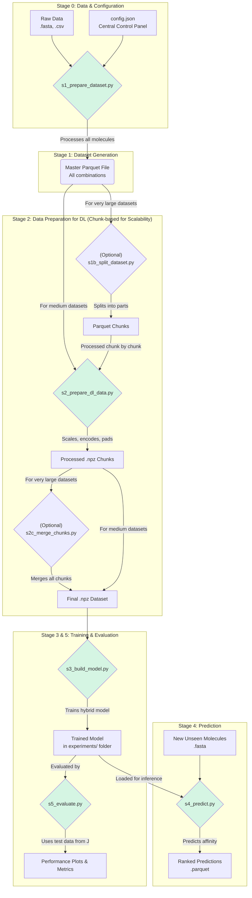

Of course. It's crucial for a project of this complexity to have a comprehensive, user-friendly, and up-to-date README. I will rewrite it extensively to reflect all the powerful upgrades and new logic we've implemented.

Here is the updated, in-depth README file.

-----

# BioSeq-AffinityPredict: A Hybrid Deep Learning Framework for Predicting Molecular Affinity

[](https://opensource.org/licenses/MIT)
[](https://www.python.org/downloads/)
[](https://www.tensorflow.org/)
[](https://github.com/psf/black)

A research-grade, hybrid deep learning framework for predicting the binding affinity between molecules (e.g., miRNA-RNA), explicitly modeling the competitive effects of other molecules in the system. This framework features a universal feature engineering pipeline that processes RNA, protein, and 3D structural data, making it a powerful and adaptable tool for discovering novel therapeutic candidates.

-----

## Abstract

The regulation of gene expression by microRNAs (miRNAs) is a fundamental biological process implicated in numerous diseases. Computational prediction of miRNA-target affinity is critical for identifying therapeutic candidates, yet models often oversimplify the complex cellular environment. This project, **BioSeq-AffinityPredict**, introduces a state-of-the-art hybrid **CNN-LSTM-Attention-GNN** architecture to perform a regression task, predicting a continuous binding affinity score. Critically, our framework features a universal molecule processor that automatically handles RNA and protein sequences, performs reverse translation, and integrates 3D structural data (PDB/mmCIF) to generate graph-based features. This allows for a more nuanced, biologically relevant, and accurate prediction of molecular interactions.

-----

## Project Workflow

This diagram illustrates the complete, end-to-end data processing and modeling pipeline.



-----

## Key Features

  - **🧠 Hybrid Deep Learning Architecture:** Goes beyond simple CNNs to a "Supreme" model fusing **CNNs** (for motif detection), **LSTMs** (for sequential context), **Attention** (for inter-sequence relationships), and **Graph Neural Networks (GNNs)** (for 3D structural information).
  - **🔬 Universal Molecule Processor:** A powerful feature engineering engine (`molecule_processors.py`) that:
      - Auto-detects sequence types (RNA vs. Protein).
      - Performs reverse translation for protein sequences using configurable codon usage tables.
      - Integrates experimental 3D structures (PDB/mmCIF) by intelligently matching them to sequences (by ID or sequence similarity).
      - Uses external tools like **ViennaRNA** (`RNAfold`) and **DSSR** to generate 1D and 2D structural features.
  - **🏆 Explicit Competition Modeling:** Uniquely quantifies the inhibitory effect of a competitor molecule on the primary molecule-target interaction by calculating a "competitive effect" score during prediction.
  - **⚙️ Scalable & Memory-Safe Pipeline:** The entire data preparation workflow is designed to handle massive datasets by processing data in chunks using the efficient Apache Parquet and compressed NPZ formats.
  - **🕹️ Centralized Configuration:** A single, comprehensive `config.json` file acts as the control panel for the entire project—from file paths and `experiment_id` to model hyperparameters and prediction settings.

-----

## Project Structure

The repository is organized for clarity and reproducibility. Scripts generate the `experiments`, `prediction`, and processed `dataset` folders.

```
E:/1. miRNA-RNA-Deep-Learning-Model/
├── codes/
│   ├── Version 4/                 # Location of all Python scripts
│   │   ├── s1_prepare_dataset.py
│   │   ├── s1b_split_dataset.py
│   │   ├── s2_prepare_dl_data.py
│   │   ├── s2c_merge_chunks.py
│   │   ├── s3_build_model.py
│   │   ├── s3b_incremental_training.py
│   │   ├── s4_predict.py
│   │   └── s5_evaluate.py
│   └── config.json                # Moved to be with the scripts
│
├── dataset/
│   ├── raw_data/                  # All raw input data belongs here
│   │   ├── miRNA_dataset/select/
│   │   ├── target/select/
│   │   ├── competitor/select/
│   │   ├── affinity_score/select/
│   │   └── ...
│   ├── pdb_files/                 # Optional: PDB/mmCIF files
│   │   ├── targets/
│   │   └── competitors/
│   ├── prepared_dataset/          # Output of Stage 1
│   └── processed_for_dl/          # Final output of Stage 2
│
├── experiments/                   # All training outputs are saved here
│   └── exp_001_initial_run/       # Subfolder named by experiment_id
│       ├── models/
│       ├── logs/
│       └── evaluation/
│
├── prediction/                    # For running inference on new molecules
│   ├── primary_to_rank/
│   ├── target_to_predict/
│   └── competitor_to_compare/
│
├── .gitignore
├── LICENSE
└── README.md
```

-----

## Installation

This project requires Python 3.9+ and external bioinformatics tools.

1.  **Clone the Repository:**
    ```bash
    git clone https://github.com/aamarzan/miRNA-RNA-Deep-Learning-Model.git
    cd miRNA-RNA-Deep-Learning-Model
    ```
2.  **Create and Activate a Virtual Environment (Recommended):**
    ```bash
    python -m venv venv
    source venv/bin/activate  # On Windows: venv\Scripts\activate
    ```
3.  **Install Required Python Packages:**
    ```bash
    pip install -r requirements.txt
    ```
    *(This file should contain `tensorflow`, `pandas`, `pyarrow`, `scikit-learn`, `biopython`, `seaborn`, `natsort`)*
4.  **Install External Tools:**
      - **ViennaRNA Package:** Required for `RNAfold`. Please install from the [official website](https://www.tbi.univie.ac.at/RNA/ViennaRNA/doc/html/install.html) and ensure `RNAfold` is in your system's PATH, or provide the full path in `config.json`.
      - **DSSR:** Required for analyzing 3D structures. Download from the [3DNA Forum](https://www.google.com/search?q=http://forum.x3dna.org/general-discussions/dssr-a-new-standard-in-rna-structure-analysis-and-visualization/) and provide the full path to the executable in `config.json`.

-----

## End-to-End Workflow

### Step 0: Configuration

**This is the most important step.** Before running any scripts, open `codes/Version 4/config.json` and configure it for your project:

1.  Set the `project_root` to the absolute path of the repository on your machine.
2.  Set a unique `experiment_id` for your training run.
3.  Verify all file paths in `data_sources`, `structure_folders`, and `tool_paths`.
4.  Adjust model hyperparameters in `training_parameters` as needed.

### Part A: Reproducing the Training from Scratch

This workflow is for generating the dataset and training the model.

1.  **Curate Data:** Place all your raw FASTA and score files into the appropriate subdirectories inside `dataset/raw_data/`.
2.  **Run Stage 1 (Generate Master Dataset):** This script creates the master Parquet file.
    ```bash
    python "codes/Version 4/s1_prepare_dataset.py"
    ```
3.  **Run Stage 2 (Prepare Data for DL):** This script converts the Parquet file into compressed `.npz` arrays for training. For extremely large datasets, you can optionally use `s1b_split_dataset.py` first, then run `s2_prepare_dl_data.py` on the chunks, and finally merge them with `s2c_merge_chunks.py`.
    ```bash
    python "codes/Version 4/s2_prepare_dl_data.py"
    ```
4.  **Run Stage 3 (Train the Model):** This will train the model and save all outputs (model file, logs, history) to the `experiments/<your_experiment_id>/` folder.
    ```bash
    python "codes/Version 4/s3_build_model.py"
    ```

### Part B: Using a Pre-Trained Model for Prediction (Quick Start)

This workflow is for users who want to rank new molecules using an existing model.

1.  **Configure for Prediction:** In `config.json`, go to the `prediction_parameters` section.
      - Set `experiment_to_use` to the ID of the trained model you want to use.
      - Set `model_to_use` to the name of the saved model file (e.g., `best_supreme_model.keras`).
2.  **Add Your Molecules:** Place the FASTA files for your new molecules into the subfolders inside the `prediction/` directory.
3.  **Run Prediction:**
    ```bash
    python "codes/Version 4/s4_predict.py"
    ```
    A ranked list of your primary molecules will be saved as a Parquet file in the `prediction/` folder.

### Evaluating the Model

To generate performance plots and metrics for a trained model, configure the `evaluation_parameters` in `config.json` and run:

```bash
python "codes/Version 4/s5_evaluate.py"
```

Outputs will be saved to a new timestamped folder inside `experiments/<your_experiment_id>/evaluation/`.

-----

## Citing this Work

If you use this model or code in your research, please cite our work.
*(A full citation to our paper will be provided here upon publication.)*

## License

This project is licensed under the MIT License. See the [LICENSE](https://www.google.com/search?q=LICENSE) file for details.
